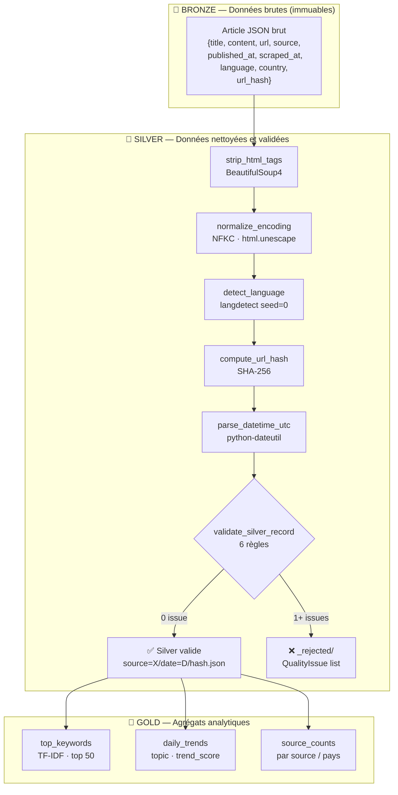
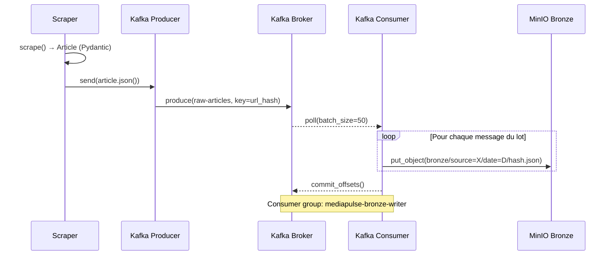

# Schéma d'Architecture — MediaPulse

## Diagramme 1 — Architecture globale

```mermaid
flowchart LR
    subgraph SOURCES["🌐 Sources d'actualité (8)"]
        direction TB
        S1[Hespress\nMA · ar]
        S2[Akhbarona\nMA · ar]
        S3[Barlamane\nMA · ar]
        S4[Lakom\nMA · ar]
        S5[Al Jazeera\nQA · en]
        S6[BBC News\nGB · en]
        S7[CNN\nUS · en]
        S8[Reuters\nGB · en]
    end

    subgraph INGESTION["⚙️ Ingestion"]
        SCR[Scraper Service\nPython · BeautifulSoup\nPydantic Article]
        KP[Kafka Producer\ntopic: raw-articles]
    end

    subgraph STREAMING["⚡ Streaming"]
        KF[Apache Kafka\nConfluentinc 7.6\nZookeeper]
        KC[Kafka Consumer\nmicro-batch=50]
    end

    subgraph DATALAKE["🪣 Data Lake — MinIO"]
        BR[🥉 Bronze\nbronze/source=X/\ndate=D/hash.json]
        BTS[BronzeToSilver\nHTML strip · Unicode\nlangdetect · SHA-256\n6 règles qualité]
        SL[🥈 Silver\nsilver/source=X/\ndate=D/hash.json]
        REJ[🗑️ _rejected/\nQualityIssue traçable]
        STG[SilverToGold\nTF-IDF keywords\ndaily trends\nsource counts]
        GD[🥇 Gold\ngold/table=X/\nrun_date=D/data.json]
    end

    subgraph WAREHOUSE["🗄️ Warehouse — PostgreSQL 16"]
        DIM[dim_source\ndim_date\ndim_category]
        FACT[fact_articles\nfact_keyword_frequency\nfact_daily_trends]
        QR[quality_report]
    end

    subgraph VISU["📊 Visualisation & Monitoring"]
        GR[Grafana 11\nPort 3001]
        MB[Metabase\nPort 3000]
        PR[Prometheus\nPort 9090]
    end

    subgraph ORCH["🌀 Orchestration — Airflow 2.9"]
        D1[dag_batch_scrape]
        D2[dag_bronze_to_silver]
        D3[dag_silver_to_gold]
        D4[dag_load_warehouse]
        D5[dag_data_quality]
    end

    SOURCES --> SCR
    SCR --> KP
    KP --> KF
    KF --> KC
    KC --> BR
    BR --> BTS
    BTS -->|accepted| SL
    BTS -->|rejected| REJ
    SL --> STG
    STG --> GD
    GD --> FACT
    DIM --> FACT
    FACT --> GR
    FACT --> MB
    PR --> GR
    ORCH -.->|schedule| SCR
    ORCH -.->|schedule| BTS
    ORCH -.->|schedule| STG
    ORCH -.->|schedule| FACT
```

---

## Diagramme 2 — Architecture Medallion (zoom couches)

---

## Diagramme 3 — Flux temps réel (Kafka)

---

## Stack technologique

| Composant | Technologie | Version | Port |
|-----------|------------|---------|------|
| Scraping | Python + BeautifulSoup4 + Pydantic | 3.11 / 4.12 / 2.8 | — |
| Message Broker | Apache Kafka (Confluent) | 7.6.1 | 9092 |
| Coordination | Zookeeper | 7.6.1 | 2181 |
| Data Lake | MinIO | 2024-07 | 9000/9001 |
| Orchestration | Apache Airflow + Celery | 2.9.3 | 8080 |
| Broker Celery | Redis | 7-alpine | 6379 |
| Entrepôt | PostgreSQL | 16 | 5432 |
| Visualisation | Grafana | 11.1.0 | 3001 |
| Analytics | Metabase | v0.50.18 | 3000 |
| Monitoring | Prometheus | 2.53.1 | 9090 |
| Containerisation | Docker Compose | v2.20+ | — |
